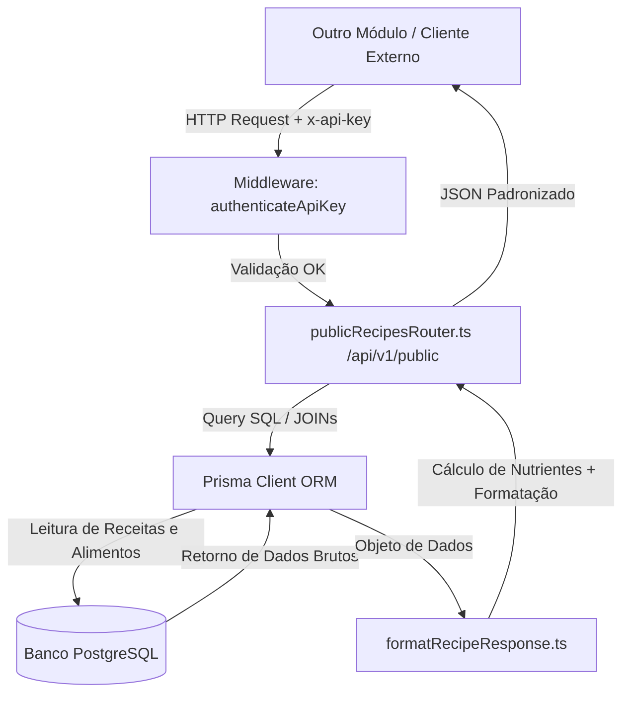

# Especificação Técnica: API Pública de Receitas (Receitas DB)

## Resumo
A **API Pública de Receitas** (/api/v1/public) fornece uma interface de comunicação REST padronizada e segura para que módulos externos ou outros microsserviços consultem, pesquisem e filtrem a base de dados de receitas do sistema **Alquimia do Prato**. Os dados retornados são consolidados a partir do banco de dados relacional PostgreSQL via Prisma, com formatação consistente e cálculo dinâmico de propriedades nutricionais.

## Índice de Revisões
| Revisão | Data       | Autor       | Descrição |
|---------|------------|-------------|-----------|
| 1.0     | 30/06/2026 | Antigravity | Elaboração do documento técnico de especificação para conexão externa. |

---

## Arquitetura de Integração

O módulo externo interage com a API através de requisições HTTP REST. As rotas públicas de receitas estão implementadas no arquivo [publicRecipesRouter.ts](file:///mnt/46F84CA3F84C935B/SAGACITAS_SaaS/Alchemist/src/infra/api/publicRecipesRouter.ts) e montadas no servidor Express no path base `/api/v1/public`.



---

## Autenticação

Todas as chamadas para a API Pública de Receitas exigem autenticação via chave de API no cabeçalho (Header) da requisição.

- **Cabeçalho Obrigatório:** `x-api-key`
- **Valor da Chave:** Deve ser igual ao token definido na variável de ambiente `APP_API_KEY` do servidor.
- **Bypass de Desenvolvimento:** Se a variável de ambiente `APP_API_KEY` estiver vazia ou com o valor padrão de demonstração (`your_app_api_key_here`), a autenticação é ignorada temporariamente em ambiente de desenvolvimento local para facilitar testes rápidos.

> [!WARNING]
> Em produção, requisições sem o cabeçalho `x-api-key` correto receberão resposta de erro com o status HTTP **401 Unauthorized**:
> ```json
> { "error": "Unauthorized: Invalid or missing API Key" }
> ```

---

## Endpoints Disponíveis

O path básico para todos os endpoints é `{HOST_URL}/api/v1/public`.

### 1. Listar Receitas (Paginado)
Retorna uma lista de receitas filtrada e paginada. Para economia de banda e performance, este endpoint **não retorna** o campo `instructions` (passos de preparo).

- **Método:** `GET`
- **Path:** `/recipes`
- **Parâmetros de Query:**
  - `limit` (opcional, padrão `20`, máximo `100`): Quantidade de itens por página.
  - `page` (opcional, padrão `1`): Número da página atual.
  - `search` (opcional): Busca textual por substring no título da receita (Case Insensitive).
  - `category` (opcional): Filtro que busca nas colunas/arrays `tipo_prato` (categoria), `momento` (ocasião) ou `base_alimento` (ingrediente base).
  - `difficulty` (opcional): Filtro por grau de dificuldade (ex: `Fácil`, `Médio`, `Difícil`).

- **Exemplo de URL:** `GET /api/v1/public/recipes?page=1&limit=10&category=Prato Principal`

- **Resposta de Sucesso (200 OK):**
  ```json
  {
    "data": [
      {
        "id": "e8d64cb2-5d9c-4623-8687-b956a9355fc2",
        "title": "Arroz de Forno Prático",
        "description": "Receita clássica de arroz de forno super colorida e saborosa.",
        "image": "/uploads/arroz_forno.jpg",
        "category": ["Acompanhamento", "Prato Principal"],
        "base_alimento": ["Massas e Grãos"],
        "momento": ["Almoço", "Jantar"],
        "origem": "Caseira",
        "difficulty": "Fácil",
        "prepTime": "30 min",
        "servings": "6 porções",
        "dietType": "Vegetariano",
        "custo_estimado": "Baixo",
        "rating": 4.8,
        "reviewsCount": 12,
        "isClassic": true,
        "createdAt": "2026-06-25T14:32:00.000Z",
        "author": {
          "name": "Maria Silva",
          "avatar": "https://url-do-avatar.com/maria.jpg"
        },
        "ingredients": [
          {
            "id": "a6713bc4-0a32-4e2e-83fb-98acb41b8a53",
            "name": "Arroz Branco Cozido",
            "category": "Cereais",
            "quantity": 400,
            "unit": "g",
            "preparationMode": "já cozido"
          }
        ],
        "nutrition": {
          "calories": 520,
          "protein": 12.5,
          "carbs": 105.2,
          "fat": 4.1
        }
      }
    ],
    "pagination": {
      "total": 1,
      "page": 1,
      "limit": 10,
      "totalPages": 1
    }
  }
  ```

---

### 2. Buscar Detalhes de uma Receita (ID Único)
Recupera todos os detalhes de uma receita específica, incluindo o array completo de `instructions` (passos de preparo).

- **Método:** `GET`
- **Path:** `/recipes/:id`
- **Exemplo de URL:** `GET /api/v1/public/recipes/e8d64cb2-5d9c-4623-8687-b956a9355fc2`

- **Resposta de Sucesso (200 OK):**
  ```json
  {
    "data": {
      "id": "e8d64cb2-5d9c-4623-8687-b956a9355fc2",
      "title": "Arroz de Forno Prático",
      "description": "Receita clássica de arroz de forno super colorida e saborosa.",
      "image": "/uploads/arroz_forno.jpg",
      "category": ["Acompanhamento", "Prato Principal"],
      "base_alimento": ["Massas e Grãos"],
      "momento": ["Almoço", "Jantar"],
      "origem": "Caseira",
      "difficulty": "Fácil",
      "prepTime": "30 min",
      "servings": "6 porções",
      "dietType": "Vegetariano",
      "custo_estimado": "Baixo",
      "instructions": [
        "Misture o arroz cozido com os legumes picados em um refratário.",
        "Cubra com queijo ralado e leve ao forno pré-aquecido a 180°C por 15 minutos para gratinar.",
        "Sirva quente imediatamente."
      ],
      "rating": 4.8,
      "reviewsCount": 12,
      "isClassic": true,
      "createdAt": "2026-06-25T14:32:00.000Z",
      "author": {
        "name": "Maria Silva",
        "avatar": "https://url-do-avatar.com/maria.jpg"
      },
      "ingredients": [
        {
          "id": "a6713bc4-0a32-4e2e-83fb-98acb41b8a53",
          "name": "Arroz Branco Cozido",
          "category": "Cereais",
          "quantity": 400,
          "unit": "g",
          "preparationMode": "já cozido"
        }
      ],
      "nutrition": {
        "calories": 520,
        "protein": 12.5,
        "carbs": 105.2,
        "fat": 4.1
      }
    }
  }
  ```

- **Resposta de Erro - Não Encontrada (404 Not Found):**
  ```json
  { "error": "Recipe not found" }
  ```

---

### 3. Pesquisa Textual Global
Realiza uma pesquisa de texto livre que confronta o termo fornecido com as propriedades de título (`title`) e descrição (`description`). Este endpoint também oculta o campo `instructions`.

- **Método:** `GET`
- **Path:** `/search`
- **Parâmetros de Query:**
  - `q` (obrigatório): O termo de busca (mínimo de 2 caracteres).
  - `limit` (opcional, padrão `10`, máximo `50`): Quantidade máxima de resultados.
- **Exemplo de URL:** `GET /api/v1/public/search?q=bolo&limit=5`

- **Resposta de Sucesso (200 OK):**
  ```json
  {
    "data": [
      {
        "id": "c0182bc3-4d9c-1123-8687-b956a9355bc2",
        "title": "Bolo de Cenoura com Chocolate",
        "description": "Tradicional bolo de cenoura fofinho com cobertura de brigadeiro.",
        "image": "/uploads/bolo_cenoura.jpg",
        "category": ["Doces e Sobremesas"],
        "base_alimento": ["Farinha"],
        "momento": ["Café da Manhã", "Lanche"],
        "difficulty": "Médio",
        "prepTime": "45 min",
        "rating": 4.9,
        "reviewsCount": 85,
        // ... (demais campos, exceto instructions)
      }
    ],
    "total": 1
  }
  ```

- **Resposta de Erro - Parâmetro Inválido (400 Bad Request):**
  ```json
  { "error": "Query \"q\" must be at least 2 characters" }
  ```

---

### 4. Consultar Categorias Disponíveis
Obtém uma lista consolidada de todas as chaves classificatórias de receitas cadastradas no banco de dados, servindo de base para estruturar filtros dinâmicos na interface do outro módulo.

- **Método:** `GET`
- **Path:** `/categories`
- **Exemplo de URL:** `GET /api/v1/public/categories`

- **Resposta de Sucesso (200 OK):**
  ```json
  {
    "tipo_prato": [
      "Acompanhamento",
      "Bebida",
      "Doces e Sobremesas",
      "Entrada",
      "Prato Principal",
      "Sopa e Caldo"
    ],
    "base_alimento": [
      "Aves",
      "Carnes",
      "Frutas",
      "Massas e Grãos",
      "Vegetais"
    ],
    "momento": [
      "Almoço",
      "Café da Manhã",
      "Jantar",
      "Lanche",
      "Pré-Treino"
    ]
  }
  ```

---

## Estrutura e Transformações dos Dados

Para garantir robustez e consistência, a API oculta detalhes do banco físico e realiza as seguintes transformações nos dados originais por meio de um formatador centralizado ([formatRecipeResponse.ts](file:///mnt/46F84CA3F84C935B/SAGACITAS_SaaS/Alchemist/src/infra/api/formatRecipeResponse.ts)):

### 1. Cálculo Nutricional Dinâmico (`nutrition`)
O objeto `nutrition` não é estático no banco de dados. Ele é recalculado no momento da requisição somando as informações nutricionais de cada ingrediente cadastrado (`RecipeIngredient` associado a `GlobalFoodItem`):
- O banco armazena o valor nutricional de cada ingrediente bruto em base de **100g** ou **100 unidades**.
- A API calcula a proporção do ingrediente na receita: `fator = quantidade_utilizada / 100`.
- Multiplica-se os valores nutricionais do item (calorias, proteínas, carboidratos e lipídios) por este fator e acumula-se no total da receita.
- Os totais de `calories` (kcal), `protein` (g), `carbs` (carboidratos em g) e `fat` (lipídios em g) são arredondados para 1 casa decimal.

### 2. Sincronização de Campos (Gotcha de UI)
- O banco de dados PostgreSQL utiliza a coluna `tipo_prato` (um array de strings) para identificar a subcategoria técnica da receita.
- A API mapeia o campo do banco `tipo_prato` para o atributo de saída `category` na resposta JSON para manter retrocompatibilidade com a estrutura de dados original utilizada no frontend SPA.

---

## Exemplos de Código de Integração

### Exemplo em TypeScript/JavaScript (usando Axios ou Fetch nativo)

```typescript
import axios from 'axios';

interface Recipe {
  id: string;
  title: string;
  description: string;
  image: string;
  category: string[];
  difficulty: string;
  rating: number;
  ingredients: Array<{
    id: string;
    name: string;
    quantity: number;
    unit: string;
  }>;
  nutrition: {
    calories: number;
    protein: number;
    carbs: number;
    fat: number;
  };
}

class RecipeClient {
  private baseUrl: string;
  private apiKey: string;

  constructor(baseUrl: string, apiKey: string) {
    this.baseUrl = baseUrl.replace(/\/$/, ''); // Remove barra no final se houver
    this.apiKey = apiKey;
  }

  private get headers() {
    return {
      'Content-Type': 'application/json',
      'x-api-key': this.apiKey
    };
  }

  /**
   * Obtém uma lista paginada de receitas
   */
  async getRecipes(page = 1, limit = 20, filters: { category?: string; search?: string } = {}) {
    try {
      const response = await axios.get(`${this.baseUrl}/api/v1/public/recipes`, {
        headers: this.headers,
        params: {
          page,
          limit,
          category: filters.category,
          search: filters.search
        }
      });
      return response.data;
    } catch (error: any) {
      console.error('Erro ao buscar receitas:', error.response?.data || error.message);
      throw error;
    }
  }

  /**
   * Obtém os detalhes completos de uma única receita com suas instruções
   */
  async getRecipeDetails(recipeId: string): Promise<Recipe> {
    try {
      const response = await axios.get(`${this.baseUrl}/api/v1/public/recipes/${recipeId}`, {
        headers: this.headers
      });
      return response.data.data;
    } catch (error: any) {
      console.error(`Erro ao buscar receita ${recipeId}:`, error.response?.data || error.message);
      throw error;
    }
  }
}

// Inicialização:
const apiConfig = {
  url: process.env.API_ALCHEMIST_URL || 'http://localhost:4005',
  key: process.env.API_ALCHEMIST_KEY || 'your-secret-api-key'
};

const client = new RecipeClient(apiConfig.url, apiConfig.key);
```

### Exemplo Usando `curl` (Testes Rápidos via Terminal)

```bash
# Consultar receitas com limite de 5 itens da categoria "Acompanhamento"
curl -X GET "http://localhost:4005/api/v1/public/recipes?limit=5&category=Acompanhamento" \
  -H "x-api-key: your-secret-api-key" \
  -H "Content-Type: application/json"
```
