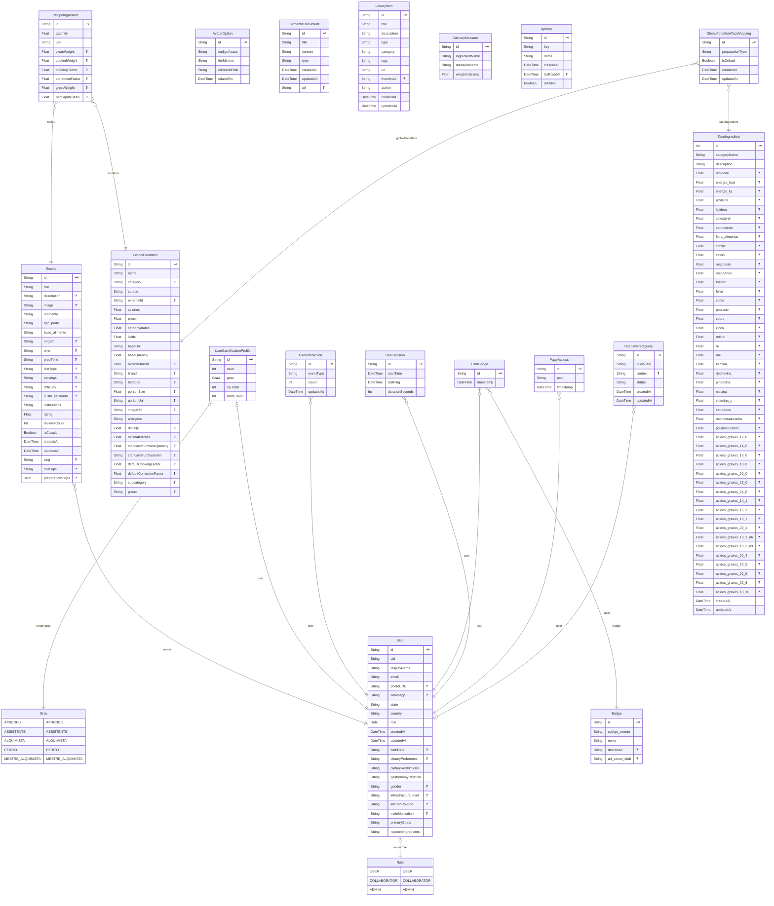

```mermaid
erDiagram

        Role {
            USER USER
COLLABORATOR COLLABORATOR
ADMIN ADMIN
        }
    


        Grau {
            APRENDIZ APRENDIZ
ASSISTENTE ASSISTENTE
ALQUIMISTA ALQUIMISTA
PERITO PERITO
MESTRE_ALQUIMISTA MESTRE_ALQUIMISTA
        }
    
  "User" {
    String id "🗝️"
    String uid 
    String displayName 
    String email 
    String photoURL "❓"
    String whatsapp "❓"
    String state 
    String country 
    Role role 
    DateTime createdAt 
    DateTime updatedAt 
    String birthDate "❓"
    String dietaryPreference "❓"
    String dietaryRestrictions 
    String gastronomyRelation 
    String gender "❓"
    String infrastructureLevel "❓"
    String kitchenRoutine "❓"
    String mainMotivation "❓"
    String primaryGoals 
    String rejectedIngredients 
    }
  

  "Recipe" {
    String id "🗝️"
    String title 
    String description "❓"
    String image "❓"
    String momento 
    String tipo_prato 
    String base_alimento 
    String origem "❓"
    String time "❓"
    String prepTime "❓"
    String dietType "❓"
    String servings "❓"
    String difficulty "❓"
    String custo_estimado "❓"
    String instructions 
    Float rating 
    Int reviewsCount 
    Boolean isClassic 
    DateTime createdAt 
    DateTime updatedAt 
    String slug "❓"
    String chefTips "❓"
    Json preparationSteps "❓"
    }
  

  "GlobalFoodItem" {
    String id "🗝️"
    String name 
    String category "❓"
    String source 
    String externalId "❓"
    Float calories 
    Float protein 
    Float carbohydrates 
    Float lipids 
    String baseUnit 
    Float baseQuantity 
    Json micronutrients "❓"
    String brand "❓"
    String barcode "❓"
    Float portionSize "❓"
    String portionUnit "❓"
    String imageUrl "❓"
    String allergens 
    Float density "❓"
    Float estimatedPrice "❓"
    Float standardPurchaseQuantity "❓"
    String standardPurchaseUnit "❓"
    Float defaultCookingFactor "❓"
    Float defaultCorrectionFactor "❓"
    String subcategory "❓"
    String group "❓"
    }
  

  "RecipeIngredient" {
    String id "🗝️"
    Float quantity 
    String unit 
    Float cleanWeight "❓"
    Float cookedWeight "❓"
    Float cookingFactor "❓"
    Float correctionFactor "❓"
    Float grossWeight "❓"
    Float perCapitaClean "❓"
    }
  

  "UserGamificationProfile" {
    String id "🗝️"
    Int nivel 
    Grau grau 
    Int xp_total 
    Int meta_nivel 
    }
  

  "UserInteraction" {
    String id "🗝️"
    String eventType 
    Int count 
    DateTime updatedAt 
    }
  

  "Badge" {
    String id "🗝️"
    String codigo_evento 
    String nome 
    String descricao "❓"
    String url_vercel_blob "❓"
    }
  

  "UserBadge" {
    String id "🗝️"
    DateTime timestamp 
    }
  

  "AvatarOption" {
    String id "🗝️"
    String codigoAvatar 
    String tierMinimo 
    String urlVercelBlob 
    DateTime criadoEm 
    }
  

  "SemanticDocument" {
    String id "🗝️"
    String title 
    String content 
    String type 
    DateTime createdAt 
    DateTime updatedAt 
    String url "❓"
    }
  

  "LibraryItem" {
    String id "🗝️"
    String title 
    String description 
    String type 
    String category 
    String tags 
    String url 
    String thumbnail "❓"
    String author 
    DateTime createdAt 
    DateTime updatedAt 
    }
  

  "UserSession" {
    String id "🗝️"
    DateTime startTime 
    DateTime lastPing 
    Int durationSeconds 
    }
  

  "PageAccess" {
    String id "🗝️"
    String path 
    DateTime timestamp 
    }
  

  "UnansweredQuery" {
    String id "🗝️"
    String queryText 
    String context "❓"
    String status 
    DateTime createdAt 
    DateTime updatedAt 
    }
  

  "CulinaryMeasure" {
    String id "🗝️"
    String ingredientName 
    String measureName 
    Float weightInGrams 
    }
  

  "ApiKey" {
    String id "🗝️"
    String key 
    String name 
    DateTime createdAt 
    DateTime lastUsedAt "❓"
    Boolean isActive 
    }
  

  "TacoIngredient" {
    Int id "🗝️"
    String categoryName 
    String description 
    Float umidade "❓"
    Float energia_kcal "❓"
    Float energia_kj "❓"
    Float proteina "❓"
    Float lipideos "❓"
    Float colesterol "❓"
    Float carboidrato "❓"
    Float fibra_alimentar "❓"
    Float cinzas "❓"
    Float calcio "❓"
    Float magnesio "❓"
    Float manganes "❓"
    Float fosforo "❓"
    Float ferro "❓"
    Float sodio "❓"
    Float potassio "❓"
    Float cobre "❓"
    Float zinco "❓"
    Float retinol "❓"
    Float re "❓"
    Float rae "❓"
    Float tiamina "❓"
    Float riboflavina "❓"
    Float piridoxina "❓"
    Float niacina "❓"
    Float vitamina_c "❓"
    Float saturados "❓"
    Float monoinsaturados "❓"
    Float poliinsaturados "❓"
    Float acidos_graxos_12_0 "❓"
    Float acidos_graxos_14_0 "❓"
    Float acidos_graxos_16_0 "❓"
    Float acidos_graxos_18_0 "❓"
    Float acidos_graxos_20_0 "❓"
    Float acidos_graxos_22_0 "❓"
    Float acidos_graxos_24_0 "❓"
    Float acidos_graxos_14_1 "❓"
    Float acidos_graxos_16_1 "❓"
    Float acidos_graxos_18_1 "❓"
    Float acidos_graxos_20_1 "❓"
    Float acidos_graxos_18_2_n6 "❓"
    Float acidos_graxos_18_3_n3 "❓"
    Float acidos_graxos_20_4 "❓"
    Float acidos_graxos_20_5 "❓"
    Float acidos_graxos_22_5 "❓"
    Float acidos_graxos_22_6 "❓"
    Float acidos_graxos_18_1t "❓"
    DateTime createdAt 
    DateTime updatedAt 
    }
  

  "GlobalFoodItemTacoMapping" {
    String id "🗝️"
    String preparationType 
    Boolean isDefault 
    DateTime createdAt 
    DateTime updatedAt 
    }
  
    "User" |o--|| "Role" : "enum:role"
    "Recipe" }o--|| "User" : "owner"
    "RecipeIngredient" }o--|| "GlobalFoodItem" : "foodItem"
    "RecipeIngredient" }o--|| "Recipe" : "recipe"
    "UserGamificationProfile" |o--|| "Grau" : "enum:grau"
    "UserGamificationProfile" |o--|| "User" : "user"
    "UserInteraction" }o--|| "User" : "user"
    "UserBadge" }o--|| "Badge" : "badge"
    "UserBadge" }o--|| "User" : "user"
    "UserSession" }o--|| "User" : "user"
    "PageAccess" }o--|| "User" : "user"
    "UnansweredQuery" }o--|o "User" : "user"
    "GlobalFoodItemTacoMapping" }o--|| "GlobalFoodItem" : "globalFoodItem"
    "GlobalFoodItemTacoMapping" }o--|| "TacoIngredient" : "tacoIngredient"
```
